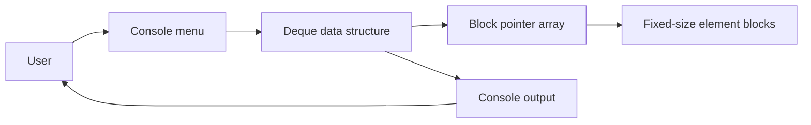

<div align="center">

# Deque

**A C++ template deque with block-based storage and a console menu for exploring its operations.**

[](https://isocpp.org/)
[](https://visualstudio.microsoft.com/)
[](#-license--author)

</div>

---

## Overview

This project implements a generic double-ended queue (`Deque<dataType>`) in C++. Elements are stored in fixed-size blocks, with a dynamically resized array of block pointers. A console application provides an interactive menu for trying the deque operations.

## Key Features

- **Operations at both ends:** Add and remove elements at the front or back.
- **Block-based storage:** Stores elements in blocks of eight and expands its block-pointer array as needed.
- **Template-based:** Use the deque with different element types that support the operations you need.
- **Indexed operations:** Access, insert, and erase elements by position.
- **Interactive demo:** Run the console app to exercise the API through a menu.

## Architecture & How It Works

The console menu in `main.cpp` reads a user's selection and calls the corresponding method on `Deque<int>`. The template implementation in `Deque/Deque.h` maps elements to blocks and indices.



## Tech Stack

| Category | Technology |
| --- | --- |
| Language | C++ |
| IDE / build project | Visual Studio 2022, MSVC v143 |
| Application | Windows console application |
| License | MIT |

## Getting Started

### Prerequisites

- Windows
- Visual Studio 2022 with the **Desktop development with C++** workload
- MSVC v143 toolset and a Windows 10 SDK

### 1. Open the solution

Open `Deque.sln` in Visual Studio. Select a configuration such as **Debug** and a platform such as **x64**.

### 2. Build and run

Build the solution, then start debugging without the debugger with **Ctrl+F5**. The console menu lets you push, pop, inspect, insert, erase, and print deque elements.

### 3. Use the deque in C++

The template implementation is in `Deque/Deque.h`:

```cpp
#include "Deque/Deque.h"

int main() {
    Deque<int> values;

    values.push_back(10);
    values.push_front(5);
    values.insert(7, 1);

    int first = values.front();
    int last = values.back();
    int middle = values[1];

    values.erase(1);
    values.pop_front();
    values.pop_back();
}
```

### Available operations

| Method | Description |
| --- | --- |
| `push_front(value)` / `push_back(value)` | Add an element to either end. |
| `pop_front()` / `pop_back()` | Remove an element from either end. |
| `front()` / `back()` | Return the first or last element. |
| `insert(value, index)` / `erase(index)` | Insert or remove an element by position. |
| `operator[](index)` | Return a reference to an element by position. |
| `empty()` / `size()` | Check whether the deque is empty or get its element count. |
| `clear()` | Remove all elements. |
| `print()` | Print the elements grouped by storage block. |

Pass a valid index to indexed operations. Check that the deque is non-empty before calling `front()` or `back()`.

## License & Author

- **Author:** Costin-Daniel Ghiujan
- **License:** [MIT](LICENSE)